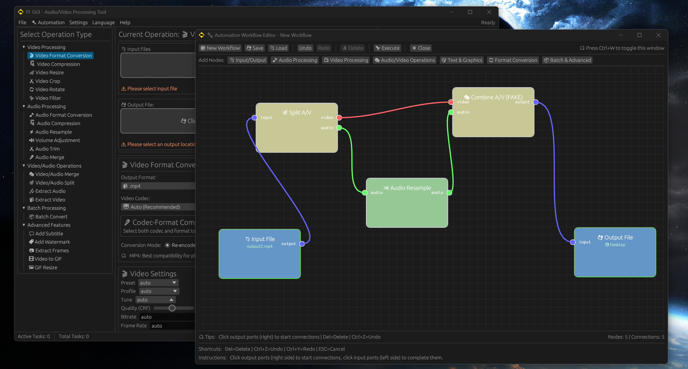

# FFmpeg GUI - Visual Automation Workflow System



## 🎯 Innovation Focus

**Revolutionary Automation Workflow** - The first FFmpeg GUI to feature a **visual node-based automation system**. Unlike traditional single-task video processors, this tool enables complex multi-step workflows through an intuitive drag-and-drop interface.

### 🚀 What Makes This Different

- **Visual Workflow Designer** - Create complex processing pipelines with drag-and-drop nodes
- **Dynamic Auto-Fill** - Smart output file naming with real-time timestamps
- **Hardware-Aware Workflows** - Automatic hardware acceleration integration in workflow nodes
- **Pure Rust Architecture** - Self-contained, no external dependencies or unsafe bindings

## 🎯 Core Innovation: Automation Workflow System

### Current Status
**Beta Release** - The breakthrough automation workflow feature is functional but actively being refined. This represents a paradigm shift from traditional FFmpeg GUIs.

### Why This Matters
Most FFmpeg GUIs are limited to single-task operations. Our **node-based workflow system** enables:
- **Complex Processing Chains** - Link multiple operations seamlessly
- **Conditional Logic** - Smart routing based on file properties
- **Batch Automation** - Process multiple files through complex workflows
- **Reusable Templates** - Save and share workflow configurations

## 🚀 Dual-Mode Architecture

### 🎭 Two Complementary Approaches

#### 1. **Traditional Mode** (Production Ready ✅)
- **Immediate Processing** - Quick single-task operations
- **Proven Reliability** - Battle-tested conversion workflows
- **Hardware Optimized** - Full acceleration support

#### 2. **Innovation: Automation Workflow** (Beta 🚧)
- **Visual Node Editor** - Drag-and-drop workflow creation
- **Multi-Step Automation** - Complex processing pipelines
- **Smart File Routing** - Conditional processing logic
- **Template System** - Reusable workflow configurations

### Technical Excellence
- **Pure Rust** - Memory-safe, no unsafe FFmpeg bindings
- **Self-Contained** - Zero external dependencies
- **Cross-Hardware** - NVENC, QSV, AMF, VideoToolbox, VAAPI support

## 🛠️ Build Requirements

### System Requirements
- **Rust** 1.70+ (Only dependency needed)
- **Windows** 10/11 (x64) - Primary target
- No C compilers, LLVM, or FFmpeg development libraries required

### Architecture Benefits
- **Pure Rust Implementation** - No unsafe FFmpeg bindings
- **Executable-based Architecture** - Uses process spawning instead of static linking
- **Simplified Build Process** - Single cargo build command
- **Cross-platform Potential** - Easy to port to other platforms

### Build Steps

#### Windows (Recommended - One-Click Build)
Use the provided PowerShell script for automated build:

```powershell
# Run the optimized build script
.\build-direct.ps1
```

The script automatically handles:
1. **FFmpeg Download** - Downloads if not present
2. **Clean Build** - Removes previous builds for fresh compilation
3. **Asset Management** - Copies FFmpeg executables and DLLs
4. **Rust Compilation** - Pure Rust build (no verbose output)
5. **Release Package** - Creates complete self-contained distribution

#### Manual Build
For developers or manual compilation:

```bash
# Pure Rust build - no additional setup required
cargo build --release

# Note: You'll need to manually copy FFmpeg assets
cp ffmpeg-static/bin/*.exe target/release/
cp ffmpeg-static/bin/*.dll target/release/
```

**Why Pure Rust?**
- No build-time dependencies on system FFmpeg
- Eliminates bindgen/LLVM requirements
- Consistent builds across different environments

## 🎯 Processing Modes

### 1. Traditional Single-Task Processing
**Status: Stable ✅**

#### Video Processing
- Format conversion (MP4, AVI, MKV, MOV, WebM, etc.)
- Resolution adjustment and cropping
- Frame rate modification and video compression
- Hardware acceleration (NVENC, QSV, AMF, VideoToolbox, VAAPI)
- Video filters and effects

#### Audio Processing
- Format conversion (MP3, AAC, FLAC, WAV, etc.)
- Sample rate and bitrate adjustment
- Volume control and audio normalization
- Audio trimming and merging

### 2. Automation Workflow System
**Status: Beta/Experimental ⚠️**

#### Working Features
- Node-based workflow system
- Drag-and-drop file input
- Auto-fill output with dynamic timestamps
- Basic workflow execution
- Hardware acceleration compatibility

#### Under Development
- Visual node editor improvements
- Advanced node types
- Workflow templates
- Error handling enhancements

### Shared Features
- Real-time progress monitoring
- Comprehensive logging system
- Preset configuration management
- Multi-language support (English/Chinese)

## 📖 Usage

### Traditional Mode
1. **Launch Application**: Run `ffmpeg_gui.exe`
2. **Select Operation**: Choose video/audio processing from tabs
3. **Import Files**: Click browse or drag files to interface
4. **Configure Settings**: Set format, quality, hardware acceleration
5. **Start Processing**: Click start button for conversion

### Automation Workflow Mode (Beta)
1. **Switch to Workflow Tab**: Click "Automation Flow" tab
2. **Create Workflow**: Add nodes by right-clicking
3. **Connect Nodes**: Drag between node connection points
4. **Configure Nodes**: Double-click nodes to set parameters
5. **Execute Workflow**: Click "Execute Workflow" button

**Note**: Automation workflow is experimental. Use traditional mode for production work.

## 📋 Architecture

### Bundled FFmpeg Approach

This application uses bundled FFmpeg executables instead of static library linking:

- **bundled_ffmpeg.rs** - Manages FFmpeg executable detection and execution
- **ffmpeg_worker_simple.rs** - Simplified worker using external commands
- **task_executor.rs** - High-level task processing

### Benefits
- **Simplicity** - No complex static library linking
- **Reliability** - Uses proven FFmpeg executables
- **Self-contained** - Everything needed is included
- **Cross-environment** - Works in various Windows environments

## 📁 Project Structure

```
ffmpeg-gui/
├── src/
│   ├── main.rs              # Main program entry
│   ├── app_state.rs         # Application state management
│   ├── ui_components.rs     # UI components
│   ├── bundled_ffmpeg.rs    # Bundled FFmpeg management
│   ├── ffmpeg_worker_simple.rs # Simplified FFmpeg worker
│   ├── task_executor.rs     # Task executor
│   ├── codec_manager.rs     # Codec management
│   ├── preset_manager.rs    # Preset management
│   ├── operation_settings.rs # Operation settings
│   ├── hardware_detector.rs # Hardware detection
│   ├── automation_flow.rs   # Automation workflow (BETA)
│   └── language.rs          # Multi-language support
├── ffmpeg-static/           # FFmpeg executables and libraries
│   ├── bin/                 # FFmpeg executables
│   ├── lib/                 # FFmpeg libraries
│   └── include/             # FFmpeg headers
├── build.rs                 # Build script (simplified)
├── build-direct.ps1         # Windows build script
├── Cargo.toml              # Rust project configuration
├── icon.ico                # Application icon
└── README.md               # Documentation
```

## 🐛 Troubleshooting

### Common Issues

**1. FFmpeg executables not found**
```
FFmpeg executables not found. Please ensure ffmpeg.exe and ffprobe.exe are in the same directory as the application
```
**Solution:** 
- Run the build script which automatically downloads FFmpeg
- Manually copy `ffmpeg.exe` and `ffprobe.exe` to the release directory

**2. DLL not found errors**
```
avcodec-61.dll not found
```
**Solution:** Ensure all FFmpeg DLLs are copied to the same directory as the executable

**3. Permission errors**
```
Access denied when executing FFmpeg
```
**Solution:** 
- Run as administrator if needed
- Check antivirus software blocking FFmpeg executables

**4. Environment compatibility issues**
```
Command execution failed
```
**Solution:** Ensure FFmpeg executables have proper permissions and are not blocked by security software

### Verification Steps

Check if FFmpeg is properly bundled:
```cmd
# Navigate to release directory
cd target\release

# Test FFmpeg
.\ffmpeg.exe -version
.\ffprobe.exe -version
```

Expected files in release directory:
- `ffmpeg_gui.exe` - Main application
- `ffmpeg.exe` - FFmpeg executable
- `ffprobe.exe` - FFprobe executable
- `*.dll` - FFmpeg runtime libraries

## 📄 License

This project is licensed under an open source license. See LICENSE file for details.

FFmpeg components follow their own license terms.

---

# FFmpeg GUI - 可视化自动化工作流系统


## 🎯 创新重点

**革命性自动化工作流** - 首个具备**可视化节点自动化系统**的FFmpeg GUI。不同于传统的单任务视频处理器，本工具通过直观的拖放界面实现复杂的多步骤工作流。

### 🚀 差异化优势

- **可视化工作流设计器** - 通过拖放节点创建复杂处理流水线
- **动态自动填充** - 智能输出文件命名，实时时间戳
- **硬件感知工作流** - 工作流节点中自动集成硬件加速
- **纯Rust架构** - 自包含，无外部依赖或unsafe绑定

## 🎯 核心创新：自动化工作流系统

### 当前状态
**测试版本** - 突破性的自动化工作流功能已可用但正在积极优化。这代表了对传统FFmpeg GUI的范式转变。

### 为什么这很重要
大多数FFmpeg GUI仅限于单任务操作。我们的**基于节点的工作流系统**实现：
- **复杂处理链** - 无缝链接多个操作
- **条件逻辑** - 基于文件属性的智能路由
- **批量自动化** - 通过复杂工作流处理多个文件
- **可重用模板** - 保存和共享工作流配置

## 🚀 双模式架构

### 🎭 两种互补方法

#### 1. **传统模式**（生产就绪 ✅）
- **即时处理** - 快速单任务操作
- **验证可靠性** - 经过实战检验的转换工作流
- **硬件优化** - 完整加速支持

#### 2. **创新：自动化工作流**（测试版 🚧）
- **可视化节点编辑器** - 拖放式工作流创建
- **多步骤自动化** - 复杂处理流水线
- **智能文件路由** - 条件处理逻辑
- **模板系统** - 可重用工作流配置

### 技术卓越
- **纯Rust** - 内存安全，无unsafe FFmpeg绑定
- **自包含** - 零外部依赖
- **跨硬件** - 支持多种硬件加速

## 🛠️ 编译要求

### 系统要求
- **Rust** 1.70+（唯一需要的依赖）
- **Windows** 10/11 (x64) - 主要目标平台
- 无需C编译器、LLVM或FFmpeg开发库

### 架构优势
- **纯Rust实现** - 无unsafe FFmpeg绑定
- **基于可执行文件架构** - 使用进程生成而非静态链接
- **简化构建流程** - 单一cargo构建命令
- **跨平台潜力** - 易于移植到其他平台

### 编译步骤

#### Windows（推荐 - 一键构建）
使用提供的PowerShell脚本进行自动化构建：

```powershell
# 运行优化的构建脚本
.\build-direct.ps1
```

该脚本自动处理：
1. **FFmpeg下载** - 如不存在则下载
2. **清洁构建** - 移除之前的构建
3. **资源管理** - 复制FFmpeg文件
4. **Rust编译** - 纯Rust构建（无冗余输出）
5. **发布包** - 创建完整自包含分发版

#### 手动编译
面向开发者或手动编译：

```bash
# 纯Rust构建 - 无需额外设置
cargo build --release

# 注意：您需要手动复制FFmpeg资源
cp ffmpeg-static/bin/*.exe target/release/
cp ffmpeg-static/bin/*.dll target/release/
```

**为什么使用纯Rust？**
- 构建时无需系统FFmpeg依赖
- 消除bindgen/LLVM需求
- 在不同环境中保持一致构建

## 🎯 处理模式

### 1. 传统单任务处理
**状态：稳定 ✅**

#### 视频处理
- 格式转换（MP4, AVI, MKV, MOV, WebM等）
- 分辨率调整和裁剪
- 帧率修改和视频压缩
- 硬件加速（NVENC, QSV, AMF, VideoToolbox, VAAPI）
- 视频滤镜和特效

#### 音频处理
- 格式转换（MP3, AAC, FLAC, WAV等）
- 采样率和码率调整
- 音量控制和音频标准化
- 音频裁剪和合并

### 2. 自动化工作流系统
**状态：测试/实验性 ⚠️**

#### 可用功能
- 基于节点的工作流系统
- 拖放式文件输入
- 动态时间戳自动填充输出
- 基本工作流执行
- 硬件加速兼容性

#### 开发中
- 可视化节点编辑器改进
- 高级节点类型
- 工作流模板
- 错误处理增强

### 共享功能
- 实时进度监控
- 全面日志系统
- 预设配置管理
- 多语言支持（英中文）

## 📖 使用方法

### 传统模式
1. **启动应用**：运行 `ffmpeg_gui.exe`
2. **选择操作**：从标签页选择视频/音频处理
3. **导入文件**：点击浏览或拖拽文件到界面
4. **配置设置**：设置格式、质量、硬件加速
5. **开始处理**：点击开始按钮进行转换

### 自动化工作流模式（测试版）
1. **切换到工作流标签**：点击"自动化流程"标签
2. **创建工作流**：右键点击添加节点
3. **连接节点**：在节点连接点间拖拽
4. **配置节点**：双击节点设置参数
5. **执行工作流**：点击"执行工作流"按钮

**注意**：自动化工作流为实验功能，生产环境请使用传统模式。

## 📋 架构说明

### 内置FFmpeg方案

此应用程序使用内置FFmpeg可执行文件而非静态库链接：

- **bundled_ffmpeg.rs** - 管理FFmpeg可执行文件检测和执行
- **ffmpeg_worker_simple.rs** - 使用外部命令的简化工作器
- **task_executor.rs** - 高级任务处理

### 优势
- **简单性** - 无复杂静态库链接
- **可靠性** - 使用经过验证的FFmpeg可执行文件
- **自包含** - 包含所需的一切
- **跨环境** - 在各种Windows环境中工作

## 📁 项目结构

```
ffmpeg-gui/
├── src/
│   ├── main.rs              # 主程序入口
│   ├── app_state.rs         # 应用状态管理
│   ├── ui_components.rs     # UI组件
│   ├── bundled_ffmpeg.rs    # 内置FFmpeg管理
│   ├── ffmpeg_worker_simple.rs # 简化FFmpeg工作器
│   ├── task_executor.rs     # 任务执行器
│   ├── codec_manager.rs     # 编解码器管理
│   ├── preset_manager.rs    # 预设管理
│   ├── operation_settings.rs # 操作设置
│   ├── hardware_detector.rs # 硬件检测
│   ├── automation_flow.rs   # 自动化流程（测试版）
│   └── language.rs          # 多语言支持
├── ffmpeg-static/           # FFmpeg可执行文件和库
│   ├── bin/                 # FFmpeg可执行文件
│   ├── lib/                 # FFmpeg库文件
│   └── include/             # FFmpeg头文件
├── build.rs                 # 构建脚本（简化版）
├── build-direct.ps1         # Windows构建脚本
├── Cargo.toml              # Rust项目配置
├── icon.ico                # 应用图标
└── README.md               # 文档
```

## 🐛 故障排除

### 常见问题

**1. FFmpeg可执行文件未找到**
```
FFmpeg executables not found. Please ensure ffmpeg.exe and ffprobe.exe are in the same directory as the application
```
**解决方案：**
- 运行构建脚本自动下载FFmpeg
- 手动复制到发布目录

**2. DLL未找到错误**
```
avcodec-61.dll not found
```
**解决方案：** 确保所有FFmpeg DLL复制到可执行文件同目录

**3. 权限错误**
```
Access denied when executing FFmpeg
```
**解决方案：**
- 如需要以管理员身份运行
- 检查杀毒软件是否阻止FFmpeg

**4. 环境兼容性问题**
```
Command execution failed
```
**解决方案：** 确保FFmpeg可执行文件有适当权限且未被安全软件阻止

### 验证步骤

检查FFmpeg是否正确打包：
```cmd
# 进入发布目录
cd target\release

# 测试FFmpeg
.\ffmpeg.exe -version
.\ffprobe.exe -version
```

发布目录中应有的文件：
- `ffmpeg_gui.exe` - 主应用程序
- `ffmpeg.exe` - FFmpeg可执行文件
- `ffprobe.exe` - FFprobe可执行文件
- `*.dll` - FFmpeg运行时库

## 📄 许可证

本项目采用开源许可证，具体信息请查看LICENSE文件。

FFmpeg组件遵循其自身的许可证条款。
